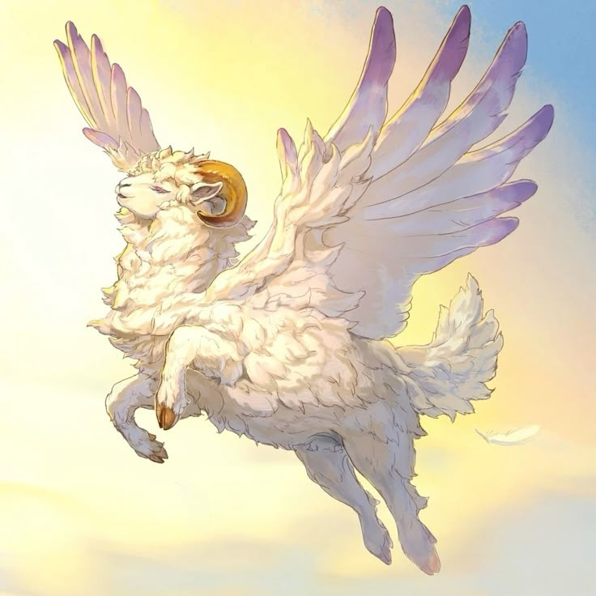

# 🕊️ **ELISEU BABOSA**


### Anjo Menor Puro • Curandeiro • Ordem dos Cavaleiros Hospitalares

---

# 📖 **HISTÓRIA**

Ishgard. Antes conhecido como “o continente esquecido”, foi salvo e restaurado pelas mãos da Guardiã Erika e seus companheiros Aventurine, Dian, Greed, Ko-rinn, M7 e Vicky, na batalha contra o Salvador. 

Diferente dos grandes impérios e reinos antigos do mundo, Ishgard é recente, um continente ainda em desenvolvimento. Um lugar onde as cidades ainda não nasceram, e as histórias estão apenas começando a ser escritas. Aqui, entre a natureza bruta e a energia divina instável, surgiram pequenas vilas. E entre elas, uma em especial: a vila dos anjos menores puros. 

Um refúgio sagrado, lar de seres celestiais com dom inato para a cura. Ali, entre rebanhos de ovelhas, plantações de ervas sagradas e relíquias mágicas deixadas por viajantes em troca de cuidados, nasceu Eliseu Babosa. 

Desde pequeno, Eliseu aprendeu o valor de proteger. Mas também aprendeu o que é a solidão. 

Ele foi um dos últimos anjos puros daquela geração. Sem outras crianças da sua idade, cresceu entre adultos ocupados e anciãos silenciosos (seus únicos amigos eram as ovelhas). Era solitário, mas sempre prestativo. Havia sempre algo a fazer: um ferimento para cuidar, uma erva para colher, um rebanho para alimentar. Fazia tudo com dedicação. Mas em seu coração, havia uma inquietação constante:

“Eu queria poder dividir isso com alguém.” 

Eliseu sonhava com um rebanho só seu, não de ovelhas, mas de amigos. Pessoas em quem pudesse confiar. Que também confiassem nele. E por elas, ele seria capaz de tudo. Proteger era mais do que um instinto, era seu sonho. 

Na vila, era tradição: ao completar 16 anos, cada anjo partia para a Escola de Magia, onde aprenderia a canalizar seu dom e se tornaria um guardião da integridade no mundo exterior. 

E assim, Eliseu partiu. 

Não só para aprender magia. 

Mas para buscar aquilo que lhe faltava. Amigos. Parceiros. Meio igual a meio. E alguém por quem valesse a pena lutar.


---

# 📌 **INFORMAÇÕES DO PERSONAGEM**

**Nome:** Eliseu Babosa

**[Raça](https://www.dandwiki.com/wiki/Minor_Angel_(5e_Race)):** Anjo Menor Puro

**Antecedente:** Fazendeiro

**Nível:** 5

**[Classe](https://www.dandwiki.com/wiki/Healer_(5e_Class)#Renewal):** Curandeiro

**Subclasse:** Ordem dos Cavaleiros Hospitalares

**Tendência:** Leal e Caótico

**Idiomas:** Comum, Celestial, Abissal

**Bônus de Proficiência:** +3

**Iniciativa:** +2

**Deslocamento:** 9 m (caminhada), 9 m (voo)

**CD de Magia:** 20 (+2 para Evocação)

**Ataque Mágico:** +11

**Pontos de Sorte:** 3/3

**PO:** 597

---

# 💠 **ATRIBUTOS**

| Atributo     | Valor  | Modificador |
| ------------ | ------ | ----------- |
| Carisma      | **23** | **+6**      |
| Constituição | **15** | **+2**      |
| Destreza     | 15     | +2          |
| Sabedoria    | 12     | +1          |
| Inteligência | 12     | +1          |
| Força        | 9      | -1          |

---

# ❤️ **PONTOS DE VIDA**

* **PV Total:** 44 (**-5**) 
* **PV Atuais:** 44

---

# 🛡️ **CLASSE DE ARMADURA**

* **CA Total:** 20

---

# 🎓 **PROFICIÊNCIAS**

### **Armas e Armaduras**

* Armaduras leves, médias e pesadas
* Escudos
* Armas simples
* Armas marciais (pela Subclasse)
* Arco e Flecha

### **Ferramentas**

* Kit de Herbalismo
* Kit de Curandeiro

### **Testes de Resistência**

* Constituição (**+5**)
* Carisma (**+9**)

### **Perícias Escolhidas**

* Medicina (dobro de proficiência)
* Religião
* Intuição
* Persuasão

### **Resistências e Vulnerabilidades**

* **Resistência:** Dano Necrótico e Radiante
* **Vulnerabilidade:** Dano Gélido

---

# ✨ **HABILIDADES DE CLASSE — CURANDEIRO**

---

## **MÃOS QUE CURAM (Nível 1)**

Magias de cura de 1º nível ou superior adicionam seu modificador de Carisma **duas vezes**, caso ele ainda não tenha sido aplicado.

---

## **FOCO MÉDICO (Nível 1)**

* Proficiência em Medicina (já incluída)
* Dobra o bônus de proficiência em Medicina
* Kit de Curandeiro pode ser usado como ação bônus

---

## **COMPANHEIRO CELESTIAL (Nível 2)**

Criatura invocável por 1 hora.
Efeitos iniciais:

* Aliados a 3 m recuperam PV = mod Carisma ao invocar
* Obedece comandos
* Em combate só usa Esquiva, a menos que comandado
* Pode ser invocado 2x por descanso curto/longo
* Se receber **Poupar a Morte**, cura 2d6 PV

Nível 6:

* Pode conjurar suas magias de cura através do companheiro

---

## **CURA SEM ESFORÇO (Nível 3)**

Magias de cura e estabilização podem ser conjuradas como **ação bônus**.

---

## **TOQUE DE LIMPEZA (Nível 8)**

Ao curar alguém, também remove:

* doença
* cegueira
* surdez
* paralisia
* envenenamento
* atordoamento

---

## **RENOVAÇÃO (Nível 10/20)**

Nível 10:

* Regenera membros
* Cura PV = dobro do nível
* Cura PV igual à metade do nível por minuto durante 1h

Nível 20:

* Pode **reviver 1 criatura** sem custo (1x descanso longo).

---

# ⚔️ **HABILIDADES DE SUBCLASSE: ORDEM DOS CAVALEIROS HOSPITALARES**

---

## **TREINAMENTO MARCIAL (Nível 1)**

Proficiência adicional com:

* Armas marciais
* Armaduras médias e pesadas
* Escudos

---

## **ORDENANÇA DIVINA (Nível 3)**

Usa **Carisma** para:

* CA com armadura (substitui Destreza)
* Ataques e dano com armas (substitui Força ou Destreza)

---

## **IMPOSIÇÃO DE MÃOS (Nível 3)**

Pool de cura = 5 × nível de Curandeiro. Com uma ação eu posso tocar uma criatura e restaurar uma quantidade de pontos de vida que você retirar da pool.

---

## **MONTARIA CELESTIAL (Nível 3)**

Companheiro pode virar uma **Montaria Grande**.
Voo apenas a partir do nível 14.

---

## **ATAQUE EXTRA (Nível 6)**

2 ataques por ação de ataque.

---

## **TOQUE DE LIMPEZA (Nível 14)**

Pode finalizar uma magia em si ou aliado (mod Carisma por descanso longo).

---

## **CORRENTE DE CURA (Nível 18)**

Cura adicional ao lançar magias (1 alvo):

* mod Carisma + nível da magia
* Alcance: 18 m

---

# 📜 **MAGIAS**

### **Truques**

* Consertar
* Estabilizar
* Orientação
* Resistência
* Raio de Gelo
* Toque Arrepiante

### **1º Nível**

* Encontrar Familiar (Salus)
* Comando
* Curar Ferimentos
* Detectar Magia
* Raio Guiador
* Santuário

### **2º Nível**

* Restauração Menor

---

# 🐑 **COMPANHEIRO CELESTIAL — BABOSA**



**Tipo:** Celestial (Ovelha Celestial)

**CA:** 13
**PV:** 25 (5 + 5x seu nível)
**Deslocamento:** 9 m (caminhada), 22 m (voo)

**Atributos:**
FOR 14 (+2), DES 14 (+2), CON 14 (+2), INT 11 (+0), SAB 13 (+1), CAR 15 (+2)

**Imunidades:**

* Dano: Veneno
* Condição: Encantado, Assustado, Paralisado, Envenenado

**Sentidos:**

* Visão no escuro 18 m
* Percepção passiva 12

**Idiomas:** Celestial + todos que você fala
**Telepatia:** 30 m

### **Ações**

* **Pancada:** Ataque mágico para atingir = 1d8 + PB (contundente)
* **Raio Celestial:**  Ataque mágico para atingir = 1d8 + PB (radiante)
* **Teletransporte:** Teletransporta criaturas em um raio de 1,5 m a até 4,5 m e concede 1d4 + PB de PV temporários

---

# 😈 **FAMILIAR — SALUS WIDE**


Tipo: Celestial (Diabrete Celestial)

**CA:** 11
**PV:** 1
**Deslocamento:** 1,5 m (caminhada), 18 m (voo)

**Atributos:**
FOR 3, DES 13, CON 8, INT 2, SAB 14, CAR 7

**Sentidos:** Visão no Escuro 36 m
**Telepatia:** 30 m

### **Habilidades**

* **Sobrevoo:** não provoca ataques de oportunidade
* **Visão Aguçada:** vantagem em Percepção baseada em visão
* **Direcionamento de dano:** 1 vez por turno, o Salus pode redirecionar dano que o Eliseu tomar (mas ele não pode ser reduzido)

---

# 🔮 **COMBO DE COMBATE**

### **Antes**

* Usar *Ajuda* (+11 de vida máxima)

### **Início**

* Ativar Aura (6 de vida temporária + 6 no próximo ataque e teste de resistência)
* Abençoar Aurélia, Matteo e Orianna
* Invocar Companheiro (7 de vida em um raio de 6 m)
* Familiar analisa ambiente
* Mover para ponto estratégico

### **Rotação Fixa**

* As curas são no maior nível que eu posso conjurar
* A cura é máximizada e soma +1
* Pode usar *Curar Ferimentos* 3x sem gastar espaço (54 de cura + 6 no próximo ataque e teste de resistência)
* Teleportar Companheiro (6 de vida temporária + 6 no próximo ataque e teste de resistência)
* Usar a pool para curar alguém (6 no próximo ataque e teste de resistência)
* Usar *Santuário* em alguém (6 no próximo ataque e teste de resistência)
* Usar reação caso tome dano para transferi-lo para um aliado
* Mover-se estrategicamente

---

# ⭐ **TALENTOS E HABILIDADES ADICIONAIS**

* Visão no Escuro (até 18 m)
* **Semblante da Esperança:** cura 1d6 + mod Carisma em uma área de 6 m (1x por descanso longo)
* **Fluxo Cuidadoso:** progressão de habilidades de cura (nível 10)
    ``` 
    Nível 0 - Você aprende a magia restauração menor, e pode conjurar ela uma vez por dia sem usar espaços de magia

    Nível 4 - Eu cuido de você: quando restaura vida de um aliado, a cura aumenta em 3 pontos por dado rolado

    Nível 8 - Você cuida de mim: quando conjurar uma magia em um aliado, você pode escolher estabelecer uma conexão magica com ele, se fizer isso, pode se comunicar telepaticamente com esse aliado, e o dano recebido por você é compartilhado com esse aliado, somente uma conexão pode existir por vez.

    Nível 12 - Nós cuidamos deles: quando conjurar uma magia em um aliado, você e ele realizam uma ação de movimento imediatamente

    Nível 16 - Com o poder da amizade: No momento que um aliado cair no estado morrendo, você pode usar uma reação e 25 pontos de vida para curar 10 de vida desse aliado, essa habilidade ativa "nós cuidamos deles"

    Nível 20 - Somos imparáveis: Com uma ação completa, você pode estabelecer uma conexão magica com todos os aliados, unindo os pontos de vida de todos em um só, efeitos de cura nesse estado são dobrados
    ```
* **Pastor de Ovelhas:** aura protetiva; cura reduzida em si mesmo
    ```
    Você se sente responsável por aliados próximos a você, assim como um pastor de ovelhas com o seu rebanho. Com uma ação e um espaço de magia nível 1, você pode ativar uma aura de 3 metros que concede os seguintes benefícios: sempre que um aliado precisar realizar um teste de resistência, ele ganha um bônus no teste igual ao seu modificador de Carisma, eles ganham vida temporária igual o seu valor de Carisma e não provocam ataques de oportunidade enquanto estiverem no alcance. Porém você se importa muito com seus aliados que acaba se esquecendo de se concentrar em você. Efeitos de cura tem metade de eficiência em você. Com um espaço de magia nível 2 o alcance aumenta para 9 metros e com um nível 3 aumenta para 27 metros.
    ```
* **Estudioso:** as suas curas aumentam +1
* **Benção de Aurea (Luz e Cura):** a sua cura é máx e seu dano é mín
    ```
    O Eliseu também pode conjurar magias de cura em sua forma verdadeira... se ele treinar o suficiente.
    ```
* **Protetor:** cura gratuita e pode maximizar nível da magia
    ```
    Você escolheu canalizar sua benção de maneira bondosa e harmônica, você aprende a magia “Curar Ferimentos” e pode usar sem gastar espaços de magia um número de vezes igual ao seu bônus de proficiência (recupera após um descanso longo), fora isso, quando conjurar uma magia que forneça cura em qualquer forma, você pode escolher conjurar a magia no maior nível que conseguir (o espaço de magia gasto ainda é o mesmo), e se fizer isso você recebe um bônus na cura igual a quantidade de dados que foram jogados.
    ```
* **Sortudo:** 3 pontos de sorte (ataques, testes, resistência)
* **Macarronada da Zyneia:** +2 PV permanente
* **Robusto:** +2 PV por nível
* **Mascara de Ovelha:** Depois de 3 dias, revela o objetivo/poderes que o seu criador tinha a respeito de seu espírito
    ```
    ```
* **Carta XV — Demônio** (nível 2 - tem um detalhe de uma linha dourada)
    ```
    O Diabo significa desejo/dependência ou tudo de ruim no mundo
    ```
    ```
    Qualquer efeito que o Eliseu causar em um aliado, ele recebe o valor de proficiência no seu dano e recebe isso de dano. Além disso, esse dano causado nele, pode ser usado para somar em qualquer teste, depois de usado ele acaba (não é acumulativo).
    ```

---

# 🧠 **PERÍCIAS**

* Acrobacia +2
* **Arcanismo +4** (soma o nível para descobrir a magia)
* Atletismo +0
* Atuação +7
* Enganação +7
* **Furtividade +5**
* **História +3 (+5 sobre Deuses)**
* Intimidação +5
* **Intuição +4**
* **Investigação +7 (Expertise)**
* **Lidar com Animais +4**
* **Medicina +7 (Expertise)**
* Natureza +1
* Cozinhar +13 (**+40 com Macarronada / +50 com Lasanhas**)
* **Percepção +4**
* **Persuasão +8**
* Prestidigitação +2
* **Religião +4 (+5 sobre Deuses)**
* **Sobrevivência +4**

---

# 🎒 **INVENTÁRIO**

* Símbolo Sagrado
* Fama (nível -2)
* Marca da Adaga com um Olho
* Carta XV (Demônio)
* Mascara de Ovelha
* Chamado do Topázio
* Chave do Quarto (nº 238)
* Armadura de Couro Batido (CA 12 + DES)
* Escudo (CA +2)
* Foice
* Pá
* Balde
* Kit de Curandeiro
* Funda
* 30 Pedras
* Mydemius/Myday

---

# 📝 **ANOTAÇÕES**

**Evento do Devon**
* Objetivo: Chegar no andar 0
* Causas: Monstros grandes espalhados
* Consequência: Morrer é para sempre
* Ajudante: Uma caveira mágica
* Problema: Metaleros, Magos, Vampiros (eliminados), Chapéus, Gêmeos
* Presente: Carta de Troca
* Carta de Presente: 1 item do seu inventário
* Carta de Troca: 1 item do inventário inimigo
* Vitória: Destruir caveira ou matar
* Descanso longo: não recupera a vida toda, cura o nível e pode gastar dado de vida para curar mais
* Descanso curto: recupera 1 espaço de magia por dado de vida
* Comida: Recupera +5 PV
* Bebida: Recupera o espaço de magia mais alto
* Recuperado: Carta do Diabo
* Recuperado: Escudo (símbolo sagrado)

**Evento Caçada**
* Selamos o pilar do tempo
* O Diabo está ligado ao pilar do tempo

**Evento Ashen**
* Colegas: Aixa, Ariarali, Eliseu

---