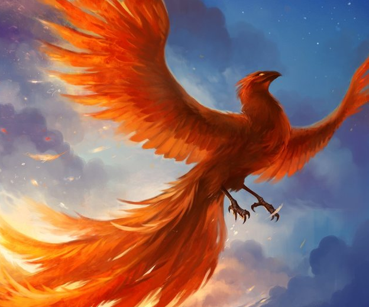
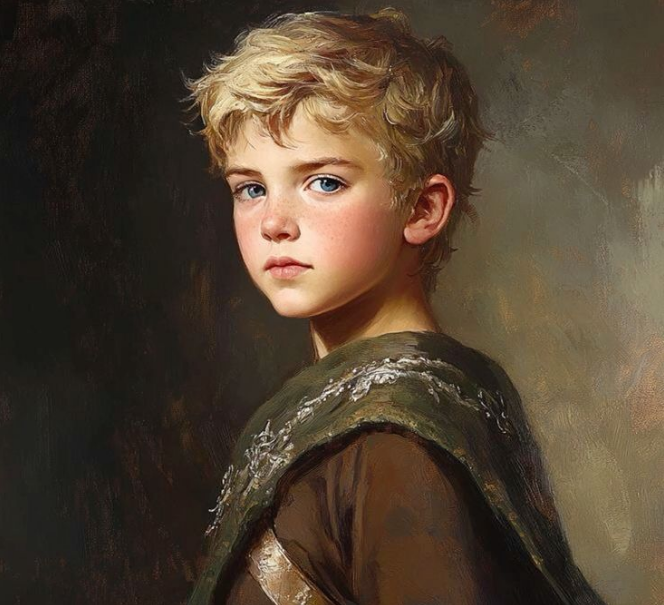
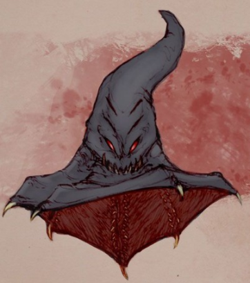

# ⚔️ **NOAH OMAR**

### Humano • Paladino • Soldado • 27 anos • 1,80 m

---

# 📖 **HISTÓRIA**

Noah Omar, o humano paladino, nasceu em circunstâncias sombrias que moldaram sua determinação e caráter. Pendurado de um corpo morto, vítima da superstição que o acusava de ser filho de uma bruxa ladra, sua infância foi uma luta constante pela sobrevivência.

Por um golpe do destino, um esquadrão de soldados devotos do Deus Thyatis, liderados pelo corajoso Capitão Alaric, passou pela aldeia e encontrou o bebê Noah, quase sem vida. Com compaixão e piedade, eles decidiram resgatá-lo, vendo nele a chance de um novo começo. O próprio Capitão Alaric, que havia perdido sua esposa e filhos para uma praga anos atrás, sentiu um vínculo especial com o órfão e o levou sob suas asas.

Noah cresceu na fortaleza dos devotos de Thyatis, onde foi criado como um dos seus próprios filhos. Sob os cuidados de Alaric e dos soldados, ele aprendeu não apenas as artes da paladinia, mas também os valores de compaixão, lealdade e justiça. Ele se tornou inseparável do filho mais novo de Alaric, que sobreviveu a praga, um jovem chamado Jumbo, e juntos enfrentaram muitas aventuras e desafios. Toda vez que estava treinando se sentia observado por trás, mas quando virava não encontrava nada

À medida que crescia, Noah desenvolveu uma devoção inabalável a Thyatis, orando e meditando diariamente para buscar orientação divina. Sua sede de amizade o impelia a conquistar o coração de todos com quem cruzasse, e ele acreditava que, através da amizade e da compreensão, poderia trazer a luz até mesmo aos corações mais sombrios.

Foi então que um dia, seu empregador, um misterioso patrono que havia ouvido falar de suas habilidades e devoção, propôs a missão de explorar a estrutura à deriva no espaço. Intrigado pelo potencial pagamento Noah aceitou o desafio. Assim, ele se lançou ao desconhecido, unido pela coragem, amizade e um desejo inabalável de fazer o bem no universo, sem imaginar os mistérios e perigos que o aguardavam.

---

# 📌 **INFORMAÇÕES DO PERSONAGEM**

**Nome:** Noah Omar

**Raça:** Humano

**Nível:** 17

**Classe:** Paladino

**Origem:** Soldado

**Idade:** 27

**Altura:** 1,80 m

---

# 💠 **ATRIBUTOS**

| Atributo         | Valor |
| ---------------- | ----- |
| **Carisma**      | 8     |
| **Constituição** | 3     |
| **Destreza**     | 4     |
| **Força**        | 3     |
| **Inteligência** | 0     |
| **Sabedoria**    | 2     |

---

# ❤️ **PONTOS DE VIDA**

* **PV Total:** 183
* **PV Atuais:** 183 (**+64**)

---

# 🔵 **PONTOS DE MANA**

* **PM Total:** 88
* **PM Atuais:** 80 (**+32**)

---

# 🛡️ **CLASSE DE ARMADURA**

* **CA Total:** 33 (**+16**)

---

# 🗡️ **ARMAS**

### **Besta Leve**

* Ataque: **1d20 + 4**
* Dano: **1d8**
* Crítico: **19–20/x2**

### **Escudo (ataque)**

* Ataque: **1d20 + 14**
* Dano: **1d4 + 3**
* Crítico: 19–20/x2

### **Espada Longa**

* Ataque: **1d20 + 14**
* Dano: **1d8 + 3**
* Crítico: 19–20/x2

---

# 👑 **ESPADA DA REALEZA**

**Ataque:**
1d20 + 18 + 8 + 5
**Dano:** 1d8 + 5
**Crítico:** 19–20/x2

**Propriedades:**

* +1 em ataque e dano
* Pode aumentar até +4 se:

  * possuir código de conduta
  * for devoto de Khalmyr
  * possuir Treinamento em Nobreza
* Bônus são **cumulativos**
* +2 de CA (Aprimoramento Defesa)
* Velocidade: +1 ataque adicional por **1 PM**

---

# ✨ **HABILIDADES**

### **Olho da Tormenta**

* +5 Percepção
* Visão perfeita no escuro (inclui escuridão mágica)
* Não pode ser flanqueado
* Pode lançar *[Visão da Verdade](https://eduardomarques.pythonanywhere.com/195/)*

---

### **Serenidade das Ondas**

* Habilidades custam metade de mana. 
* Perde quando toma 10% de dano de vida em 1 ataque. 
* Aprende "Sopro das Uivantes" e custa -1 PM

---

### **Benção de Megalokk — O Chamado Bestial**

Ação padrão + 5 PM →
+5 ataque
+5 dano
+10 redução de dano
Sustentar: ação livre + 3 PM

---

### **Maldição de LinWu — O Desonrado**

-5 ataque contra inimigo sem status negativo
+5 para resistirem às suas magias

---

### **Anel de Proteção**

+2 Defesa

---

### **Aumento de Atributo (3x)**

+1 em um atributo cada vez

---

### **Aura Antimagia**

Aliados dentro da aura podem **rolar novamente** testes de resistência contra magia

---

### **Aura Amaldiçoada**

Você consegue ver a porcentagem que a sua maldição afeta alguem.

---

### **Aura Sagrada**

Gasta 1 PM
Bônus = Carisma nos testes de resistência
Brilha como uma tocha
Custo para manter: 1 PM/turno

---

### **Aura de Cura**

Quando a aura está ativa:

* Cura **5 + Carisma** no início do turno

---

### **Aura Divina**

Todos os efeitos da aura **são dobrados**

---

### **Ataque Piedoso**

Pode causar dano não letal sem penalidade

---

### **Brado Assustador**

* Ação de movimento + 1 PM
* Inimigos em alcance curto ficam **vulneráveis**

---

### **Consagrar**

Área: esfera 9 m

* Cura de luz é **maximizada**
* +1 PM: mortos-vivos –2 testes e Defesa
* +2 PM: aumenta penalidade

---

### **Cura pelas Mãos**

1 PM → cura **1d8+1**
+1 PM a cada 4 níveis → +1d8+1
A partir do nível 6 pode remover condições como abalado, apavorado, atordoado, cego, doente, exausto, fatigado ou surdo.

---

### **Dom da Imortalidade**

Se morrer, retorna à vida em **3d6 dias**

---

### **Estilo de Arma e Escudo**

Escudo fornece **+2 adicional** de Defesa

---

### **Égide Sagrada**

2 PM → bônus de Carisma à Defesa de você e adjacentes
11º nível: pode refletir magias (só se a magia for contra você)

---

### **Esquiva**

+2 Defesa e Reflexos

---

### **Encouraçado**

+2 Defesa com armadura pesada
+2 adicionais por poderes que exijam Encouraçado

---

### **Fanático**

Armadura pesada não reduz deslocamento

---

### **Golpe Divino**

2 PM: soma Carisma no ataque + **1d12** dano
A cada 4 níveis, pode gastar +1 PM para +1d12

---

### **Julgamento Divino – Coragem**

2 PM → imunidade a medo +2 ataque contra o inimigo mais forte

### **Julgamento Divino – Justiça (Melhorada)**

2 PM → marca inimigo
Se causar dano depois, CD de Vontade = **10 + metade do nível + Carisma**
Se falhar, toma metade do dano
Custo para manter: 2 PM/turno

---

### **Sortudo**

3 PM → rerolar 1 teste

---

### **Surto Heroico**

5 PM → ação padrão ou movimento adicional

---

### **Virtude Paladinesca – Caridade**

Habilidades que tenham um aliado como alvo é reduzido em 1 PM

### **Virtude Paladinesca – Compaixão**

*Cura pelas Mãos* em alcance curto:
Para cada PM → cura **2d6+1**

### **Virtude Paladinesca – Humildade**

Primeiro turno:
Ação completa → ganha PM temporários = Carisma

---

### **Vontade de Ferro**

+1 PM por 2 níveis
+2 Vontade

---

# 🔥 **ALIADOS**

---

## **TOCHA – A FÊNIX DA TORMENTA**

Ligada à Tormenta, fiel a Noah, capaz de lutar mesmo após sua morte.

### **Formas**

* Média (sem voo)
* Grande (com voo)

### **Habilidades**

**Baforada:**

* Cone 6 m
* **12d6 + 12** dano de fogo
* Reflexos reduz metade (CD = 10 + metade do nível + Carisma)

**Conjurações ilimitadas:**

* [Raio Solar](https://eduardomarques.pythonanywhere.com/149/) 
* [Augúrio](https://eduardomarques.pythonanywhere.com/24/)
* [Coluna de Chamas](https://eduardomarques.pythonanywhere.com/40/)
* [Sopro da Salvação](https://eduardomarques.pythonanywhere.com/173/)

*(Gasta PM normalmente. Pode conjurar com ação livre gastando +3 PM.)*

**Restauração Inconcebível:**
Aura 3 m

* +2 PM temporários para aliados (não acumula)

---

## **Shamash — Escudeiro Guardião (Veterano)**

* +3 Defesa para Noah
* +2 testes de resistência

---

## **Muck — Magivocador (Veterano)**

* +1 Dado do mesmo tipo da magia
* +1 na CD para resistir

---

# 🧠 **PERÍCIAS**

(atributo + treinamento + metade do nível + bônus extras)

* **Acrobacia (Des):** +8
* **Cura (Sab):** +16
* **Furtividade (Des):** +8
* **Diplomacia (Car):** +22
* **Fortitude (Con):** +19
* **Iniciativa (Des):** +18
* **Intimidação (Car):** +22
* **Investigação (Int):** +14
* **Ladinagem (Des):** +8
* **Luta (For):** +17
* **Percepção (Sab):** +21
* **Reflexos (Des):** +18
* **Religião (Sab):** +16
* **Vontade (Sab):** +18

---

# 🔮 **COMBO DE COMBATE**

---

## **TURNO 1 – EXPLOSÃO DIVINA**

* 1 PM → ativar aura (ação livre)

  * Cura **26 por turno**
  * +16 e vantagem em testes de resistência
* 1 PM → Brado Assustador (inimigos vulneráveis, –2 CA)
* 2 PM → Julgamento Divino (Justiça – CD 28)
* 5 PM → Surto Heroico (ação extra)
* 2 PM → Égide Sagrada
* 15 PM → Coluna de Chamas (23d6, Reflexos CD 28)

---

## **TURNO 2 – SANTIFICAÇÃO TOTAL**

* Recupera 2 PM
* 1 PM → sustentar aura
* 1 PM → Consagrar área
* 5 PM → Surto Heroico
* 5 PM → Cura pelas Mãos (10d6 cura) ou remover condição (1 PM)
* 15 PM → Coluna de Chamas (23d6, Reflexos CD 28)

---

## **TURNO 3 – JULGAMENTO INCENDIÁRIO**

* Recupera 2 PM
* 1 PM → sustentar aura
* Preparar ações de cura
* 5 PM → Surto Heroico
* 5 PM → +5 ataque e dano; RD 10
* **Baforada da Fênix:** 12d6 + 12 

---

## **TURNO 4 – A MURALHA SAGRADA** (fixo)

* Recupera 2 PM
* 1 PM → sustentar aura
* 3 PM → sustentar Megalokk
* Preparar cura
* **Baforada da Fênix**: 12d6 + 12

---

## **TURNO 5 – SALVAÇÃO EM MASSA**

* Recupera 2 PM
* 1 PM → sustentar aura
* 3 PM → sustentar Megalokk
* Preparar cura
* 16 PM → Sopro da Salvação

  * Cone 9 m
  * **6d8 + 8** e levanta aliados do 0

---

# 📝 **ANOTAÇÕES**

**Evento do Noah (Convite da festa do Farsante):**
* Descobrir como atrapalhar/impedir o ritual
* Matar a criatura acaba com a maldição e salva todos dela
* Noah é a chave
* Como o olho de Szzaas é necessário pro ritual?

---